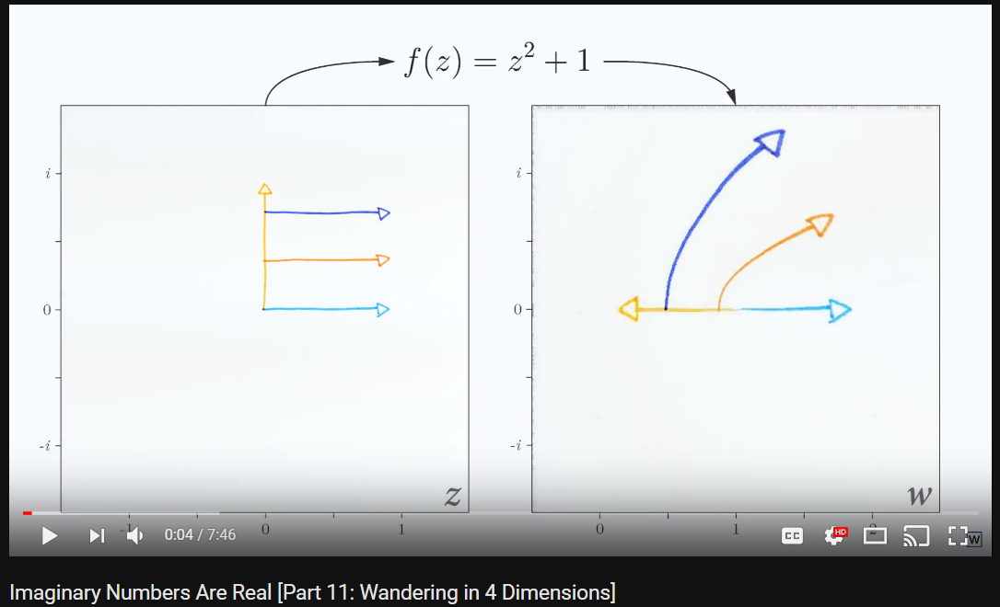

After watching [WelchLabs](http://www.welchlabs.com/)' *Imaginary Numbers Are Real* [YouTube series](https://www.youtube.com/playlist?list=PLiaHhY2iBX9g6KIvZ_703G3KJXapKkNaF), I wanted my students to be able to experiment with the awesome input-output video tool.

Welch created his video by stitching together several still images using OpenCV and Numpy. I went with javascript, and really wanted that live-video effect.

Turns out, still images are probably a better way to do things. There are some fascinating artifacts from using floating points which I don't have good ideas how to address, and the constant changes in a video make it hard to really focus in on how the function is transforming specific points.

But hey, it was fun, and still looks awesome!

`student.js` holds all the changeable pieces: set the width and height of the videos, adjust the corresponding domain/range for input/output planes; and most importantly, define a complex function to use.